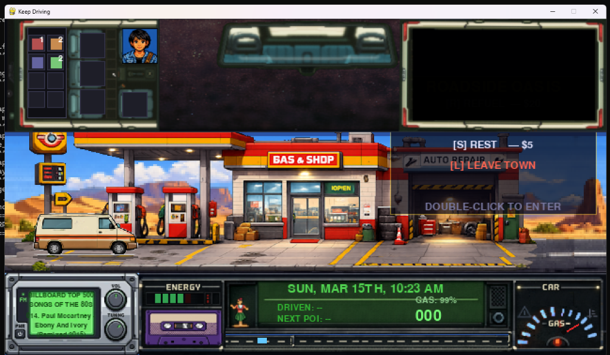

# 🚐 Keep Driving — Road Trip RPG

A high-fidelity, retro-inspired Road Trip RPG built with **Python** and **Pygame-ce**. Experience a procedurally generated journey where resource management, random encounters, fast-paced highway driving, and atmospheric storytelling perfectly merge into a single retro-aesthetic package.


_Driving across beautifully generated procedural biomes._


_Retro-styled transparent dashboard showcasing inventory, radar, and real-time analog instruments._

## 🌟 Key Features

### 🛤️ Dynamic World & Highway Driving
*   **Procedural Routes:** Every run generates a unique set of road segments, cities, specific encounters, and fully interactive settlements across distinct biomes (Desert, Forest, Mountain, Highway, Snow, City, Village, Coastal).
*   **High-Speed Mechanics & Consequences:** Accelerate up to **170 km/h** with torque-based acceleration physics! But beware: driving over 100 km/h exponentially increases the risk of fatal Police Encounters and drastically raises your real-time fuel consumption.
*   **Dynamic Backgrounds:** Multi-layered, infinitely scrolling parallax backgrounds that react to your speed, current biome, and correctly mirrored oncoming traffic logic. 
*   **Responsive AI Traffic:** Other vehicles spawn randomly on the road. Colliding with them at high speeds damages your car's physical condition and forces severe deceleration.

---

_Dynamic scaling interior graphics cleanly docking at 55% of the screen width when visiting settlements._
---

### 🎮 Advanced HUD & UI
*   **Analog Dashboard:** A highly-detailed, retro-styled lower HUD with transparent cutouts displaying a procedural scrolling road. Features a **Radar Array** that shows your vehicle's position, total distance traveled, kilometers to the next Point of Interest, and color-coded event markers.
*   **Real-time Status Management:** Keep a constant eye on Car Condition, an analog Fuel needle physics simulation, and your character's remaining Energy/Sanity. Be careful: the speedometer dial will shift into a red warning zone if you start heavily speeding.
*   **Multi-View System:** Effortlessly toggle between **Interior view (F1)** to check your seats, **Map view (F2)** to chart your strategic path across nodes, and **Road view (F3)** for intense default driving. Features character avatars seated dynamically in the top window.

### 🎭 Interactive Systems & Settlements
*   **Settlement Docking System:** When stopping at gas stations, motels, or minimarkets, the exterior traffic will pause, giving you a clean cinematic view. Double-click the building to automatically scale and display the highly-detailed **interior overview** exactly on the right-hand panel of your screen. 
*   **📟 Mixtape & Cassette System:** The system dynamically scans your music folder for `.mp3` tracks and `.png`/`.jpg` album covers, rendering them as physical retro tapes. Slide a tape into the cassette deck to change the background music!
*   **💬 Cinematic Dialogue:** Intense, multi-line branching conversational encounters feature automatic word-wrapping and character portraits. Who you pick up hitchhiking will change the course of your journey.
*   **Resource Management:** Carefully manage your cash ($) to refuel and repair your van at varying roadside stops. Fuel burns realistically depending on your speed and applied torque.

### 🌗 Atmospheric Systems
*   **Dynamic Day/Night Cycle:** A sophisticated lighting system that transitions the world from dawn to dusk, synchronized with a real-time LCD 12-hour AM/PM clock on the dashboard. At night, your car emits a glowing cone of headlights.
*   **Biome-Specific Palettes:** Each region features a painstakingly selected combination of unique procedurally colored skies, field grounds, and multiple layers of mountain ranges that shift beautifully in tone depending on the time of day.

## ⌨️ Controls

| Key | Action |
|-----|--------|
| **W / ↑** | Accelerate |
| **S / ↓** | Brake / Reverse |
| **Mouse Click**| Advance passenger dialogue, Insert Mixtapes, select Encounters |
| **Double Click**| Enter Building Interiors (When stopped at Settlements) |
| **F1** | Interior View |
| **F2** | Strategy / Map View |
| **F3** | Driving / Road View (Default) |
| **ESC** | Quit Game / Close Glovebox / Exit Encounters |

**During Settlements:**
*   **R**: Quick Interaction / Refuel Auto-Repair
*   **L**: Leave Town (Restores Traffic and Resumes Highway)

## 🛠️ Technical Stack & Architecture

*   **Engine:** [Pygame-ce](https://pyga.me/) (A highly optimized Python game engine fork).
*   **Language:** Python 3.10+
*   **Assets:** Dynamic asset loading with a specialized **Surface Cache**, preventing frame drops by pre-calculating and storing resized high-resolution textures.

## 🚀 Getting Started

1.  **Clone the Repository:**
    ```bash
    git clone https://github.com/Miltondz/keepDriving.git
    cd keepDriving
    ```

2.  **Install Dependencies:**
    ```bash
    pip install pygame-ce
    ```

3.  **Run the Game:**
    ```bash
    python main.py
    ```

## 📝 Recent Changelog (2026-03-21)

### Added
- **Dynamic Settlement Interior System:**
  - Double-clicking exterior buildings (gas stations, motels, etc.) perfectly renders their detailed interior.
  - The interior rendering dynamically docks right-aligned at a maximum of `55%` of screen width, avoiding clipping with the upper inventory HUD and lower dashboard.
  - A responsive "EXIT" boundary detects clicks scaled to the upper right edge of any internal image.
- **Render Cleanups & Visibility Toggles:**
  - Added a `render_car` toggle variable to the `GameRenderer` which natively hides the protagonist's van when docked at a settlement.
  - Prevented traffic objects from spawning in the background while the state is strictly `GameState.SETTLEMENT`, creating a clean cinematic aesthetic.

### Fixed
- **Parallax Background Gaps & Crashes:**
  - Shifted all base procedural road layers downwards by `+10 pixels` to seamlessly hide blue sky-bar anomalies leaking below textures.
  - Resolved an `IndexError` crash in background hill rendering by ensuring the `highway` biome contains exactly 3 colors for procedural layer generation.
- **Resolution Import Errors (Unbound Locals):**
  - Removed rogue duplicate imports of native resolution variables inside input handlers, terminating `UnboundLocalErrors` associated with validating global `W` and `H` viewport boundaries.

---
*Created with ❤️ for retro road-trip gaming fans.*
