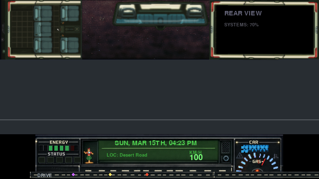

# 🚐 Keep Driving — Road Trip RPG

A high-fidelity, retro-inspired Road Trip RPG built with **Python** and **Pygame-ce**. Experience a procedurally generated journey where resource management, random encounters, and atmospheric driving meet.



## 🌟 Key Features

### 🛤️ Dynamic World & Driving
*   **Procedural Routes:** Every run generates a unique set of road segments and settlements across different biomes (Desert, Forest, Mountain, etc.).
*   **High-Speed Mechanics & Consequences:** Accelerate up to **170 km/h** with torque-based acceleration, but beware: driving over 100 km/h exponentially increases the risk of **fatal Police Encounters** and drastically raises **real-time fuel consumption**.
*   **Dynamic Backgrounds:** Multi-layered parallax scrolling that reacts to your speed, biome, and correctly mirrored oncoming traffic logic.

### 🎮 Advanced HUD & UI
*   **Animated Dashboard:** A retro-styled lower HUD with transparent cutouts displaying a procedural scrolling road, along with a **Radar Array** that shows your vehicle's position, total distance driven, km to the next Point of Interest, and color-coded event markers.
*   **Status Systems:** Track Car Condition, dynamic analog Fuel needles, Player Sanity, and a **dynamic Speedometer** that turns red when speeding.
*   **Multi-View System:** Toggle between **Interior view (F1)**, **Map view (F2)**, and **Road view (F3)**, now featuring appropriate character seating avatars.

### 🎭 Encounters & Survival
*   **Narrative Dialogue:** Interactive encounters with hitchhikers, police, and strange roadside events.
*   **Resource Management:** Manage your cash to refuel and repair your van at settlements like "Dusty Creek" or "Bayside".
*   **Atmospheric Audio:** Integrated music manager for that perfect road trip vibe.

## ⌨️ Controls

| Key | Action |
|-----|--------|
| **W / ↑** | Accelerate |
| **S / ↓** | Brake / Reverse |
| **F1** | Interior View |
| **F2** | Strategy / Map View |
| **F3** | Driving / Road View (Default) |
| **ESC** | Quit Game |

**During Settlements:**
*   **R**: Interaction / Enter Shop
*   **L**: Leave Town

## 🛠️ Technical Stack

*   **Engine:** [Pygame-ce](https://pyga.me/) (Python Game Engine)
*   **Language:** Python 3.10+
*   **Graphics:** Custom pixel-art assets with real-time scaling and transparency effects.

## 🚀 Getting Started

1.  **Clone the Repository:**
    ```bash
    git clone https://github.com/Miltondz/keepDriving.git
    cd keepDriving
    ```

2.  **Install Dependencies:**
    ```bash
    pip install pygame-ce
    ```

3.  **Run the Game:**
    ```bash
    python main.py
    ```

## 🗺️ Roadmap
- [x] High-speed police encounter logic.
- [x] Dynamic radar for HUD road.
- [x] Upper HUD dialogue & avatar system.
- [ ] Advanced inventory system.
- [ ] Weather-specific handling physics.

---
*Created with ❤️ for retro gaming fans.*
